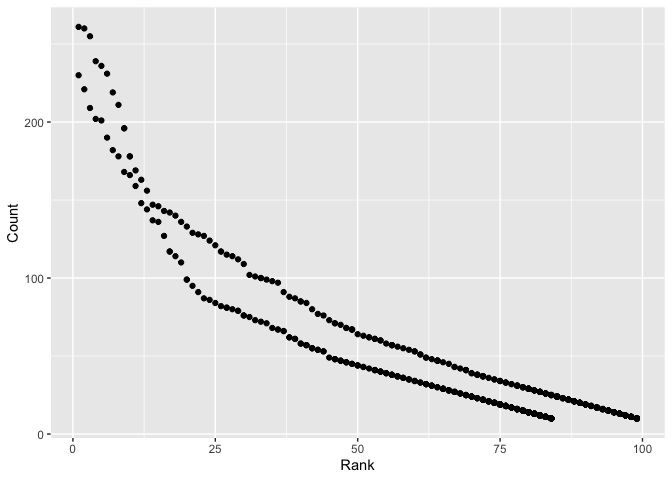

## Problem 1

Read and clean the Mr. Trash Wheel sheet:

- specify the sheet in the Excel file and to omit non-data entries (rows with notes / figures; columns containing notes) using arguments in read_excel
- use reasonable variable names
- omit rows that do not include dumpster-specific data
- round the number of sports balls to the nearest integer and converts the result to an integer variable (using as.integer)


```r
raw = readxl::read_excel("local_data/Trash-Wheel-Collection-Totals-8-6-19.xlsx")
```

```
## New names:
## * `` -> ...15
## * `` -> ...16
## * `` -> ...17
```

```r
proper_named = janitor::clean_names(raw)
rows_dropped = tidyr::drop_na(proper_named, dumpster)
rows_dropped$sports_balls = as.integer(rows_dropped$sports_balls)
```

Read and clean precipitation data for 2017 and 2018.

```r
library(dplyr)
```

```
## 
## Attaching package: 'dplyr'
```

```
## The following objects are masked from 'package:stats':
## 
##     filter, lag
```

```
## The following objects are masked from 'package:base':
## 
##     intersect, setdiff, setequal, union
```

```r
precipitaion_2017 =  readxl::read_excel(path = "local_data/Trash-Wheel-Collection-Totals-8-6-19.xlsx", sheet = "2017 Precipitation", skip = 1) %>% # use "skip" to overlook note "Precipitation (in)" in row 1
  janitor::clean_names() %>% # clean up variable names
  filter(!is.na(total) & !is.na(month)) %>% # omit rows without precipitation data
  mutate(year = 2017) %>% # add a "year" variable
  mutate(month = month.name[month]) %>% # convert number to character value of month
  select(year, month, total) # let the data be more explicit
```


```r
precipitaion_2018 =  readxl::read_excel(path = "local_data/Trash-Wheel-Collection-Totals-8-6-19.xlsx", sheet = "2018 Precipitation", skip = 1) %>% # use "skip" to overlook note "Precipitation (in)" in row 1
  janitor::clean_names() %>% # clean up variable names
  filter(!is.na(total) & !is.na(month)) %>% # omit rows without precipitation data
  mutate(year = 2018) %>% # add a "year" variable
  mutate(month = month.name[month]) %>% # convert number to character value of month
  select(year, month, total) # let the data be more explicit

precipitation_data = bind_rows(precipitaion_2017,precipitaion_2018)
precipitation_data
```

```
## # A tibble: 24 x 3
##     year month     total
##    <dbl> <chr>     <dbl>
##  1  2017 January    2.34
##  2  2017 February   1.46
##  3  2017 March      3.57
##  4  2017 April      3.99
##  5  2017 May        5.64
##  6  2017 June       1.4 
##  7  2017 July       7.09
##  8  2017 August     4.44
##  9  2017 September  1.95
## 10  2017 October    0   
## # … with 14 more rows
```


Write a paragraph about these data.

__The Trash Wheel dataset is derived from `Mr. Trash Wheel` sheet in `Trash-Wheel-Collection-Totals-8-6-19.xlsx`. This dataset contains 344 observations and each with 17 related characteristics: (dumpster, month, year, date, weight_tons, volume_cubic_yards, plastic_bottles, polystyrene, cigarette_butts, glass_bottles, grocery_bags, chip_bags, sports_balls, homes_powered, x15, x16, x17). The precipitation_data dataset is derived from `2018 Precipitation` and `2017 Precipitation` sheets from the same file. This dataset contains 24 observations and each with 3 related characteristics: (year, month, total). According to the two datasets, the total precipitation in 2018 is 70.33 inches and there is a median of 8 sports balls in a dumpster in 2017.__

## Problem 2


First, clean the data in pols-month.csv.


```r
plos_month = read.csv("local_data/fivethirtyeight_datasets/pols-month.csv") %>%
  janitor::clean_names() %>%
  tidyr::separate(mon, into=c("year", "month", "day"), sep="-") %>% # break up variable mon as year, month day
  mutate(year = as.integer(year)) %>% #convert to integer variable
  mutate(day = as.integer(day)) %>%
  mutate(month = month.name[as.integer(month)]) %>%# convert to month name
  mutate(president = ifelse(prez_dem == 1, 'dem', 'gop')) %>%# create variable president
  select(year, month, president, gov_gop, sen_gop, rep_gop, gov_dem, sen_dem, rep_dem)

head(plos_month)
```

```
##   year    month president gov_gop sen_gop rep_gop gov_dem sen_dem rep_dem
## 1 1947  January       dem      23      51     253      23      45     198
## 2 1947 February       dem      23      51     253      23      45     198
## 3 1947    March       dem      23      51     253      23      45     198
## 4 1947    April       dem      23      51     253      23      45     198
## 5 1947      May       dem      23      51     253      23      45     198
## 6 1947     June       dem      23      51     253      23      45     198
```


Second, clean the data in snp.csv using a similar process to the above.


```r
snp = read.csv("local_data/fivethirtyeight_datasets/snp.csv") %>%
  janitor::clean_names() %>%
  tidyr::separate(date, into=c("month", "day", "year"), sep="/") %>% # break up variable mon as year, month day
  mutate(year = as.integer(year)) %>% #convert to integer variable
  mutate(day = as.integer(day)) %>%
  mutate(month = month.name[as.integer(month)]) %>%# convert to month name
  select(year, month, close)

head(snp)
```

```
##   year    month   close
## 1 2015     July 2079.65
## 2 2015     June 2063.11
## 3 2015      May 2107.39
## 4 2015    April 2085.51
## 5 2015    March 2067.89
## 6 2015 February 2104.50
```

Third, tidy the unemployment data so that it can be merged with the previous datasets.


```r
unemp = read.csv("local_data/fivethirtyeight_datasets/unemployment.csv") %>%
  tidyr::gather(month, unemployment, Jan:Dec) %>% # convert from wide to long
  mutate(month = month.name[match(month, month.abb)]) %>%
  janitor::clean_names()

head(unemp)
```

```
##   year   month unemployment
## 1 1948 January          3.4
## 2 1949 January          4.3
## 3 1950 January          6.5
## 4 1951 January          3.7
## 5 1952 January          3.2
## 6 1953 January          2.9
```

Join the datasets


```r
result = list(plos_month, snp, unemp) %>% purrr::reduce(inner_join, by = c("year","month"))
head(result)
```

```
##   year    month president gov_gop sen_gop rep_gop gov_dem sen_dem rep_dem
## 1 1950  January       dem      18      44     177      29      57     269
## 2 1950 February       dem      18      44     177      29      57     269
## 3 1950    March       dem      18      44     177      29      57     269
## 4 1950    April       dem      18      44     177      29      57     269
## 5 1950      May       dem      18      44     177      29      57     269
## 6 1950     June       dem      18      44     177      29      57     269
##   close unemployment
## 1 17.05          6.5
## 2 17.22          6.4
## 3 17.29          6.3
## 4 17.96          5.8
## 5 18.78          5.5
## 6 17.69          5.4
```

__The plos_month dataset is derived from `plos_month.csv` in folder `fivethirtyeight_datasets`. This dataset contains 822 observations and each with 9 related variables: (year, month, president, gov_gop, sen_gop, rep_gop, gov_dem, sen_dem, rep_dem). The snp dataset is derived from `snp.csv` in folder `fivethirtyeight_datasets`. This dataset contains 787 observations and each with 3 related variables: (year, month, close). The unemp dataset is derived from `unemployment.csv` in folder `fivethirtyeight_datasets`. This dataset contains 816 observations and each with 3 related variables: (year, month, unemployment). The final resulting dataset is the inner join of the three datasets mentioned above. It contains 786 observations and each with 11 related variables: (year, month, president, gov_gop, sen_gop, rep_gop, gov_dem, sen_dem, rep_dem, close, unemployment).__


## Problem 3

Load and tidy the data. 


```r
baby_names = read.csv("local_data/Popular_Baby_Names.csv")
skimr::skim(baby_names)
```

```
## Skim summary statistics
##  n obs: 19418 
##  n variables: 6 
## 
## ── Variable type:factor ───────────────────────────────────────────────────────────────────────────────────────────────────────────────────
##            variable missing complete     n n_unique
##  Child.s.First.Name       0    19418 19418     3021
##           Ethnicity       0    19418 19418        7
##              Gender       0    19418 19418        2
##                                  top_counts ordered
##          Ave: 38, Ril: 33, Ari: 30, Dyl: 28   FALSE
##  HIS: 5714, WHI: 5473, BLA: 2826, ASI: 2693   FALSE
##                 FEM: 9933, MAL: 9485, NA: 0   FALSE
## 
## ── Variable type:integer ──────────────────────────────────────────────────────────────────────────────────────────────────────────────────
##       variable missing complete     n    mean    sd   p0  p25  p50  p75
##          Count       0    19418 19418   33.52 38.24   10   13   20   36
##           Rank       0    19418 19418   57.5  25.36    1   38   59   78
##  Year.of.Birth       0    19418 19418 2013.12  1.6  2011 2012 2013 2014
##  p100     hist
##   426 ▇▁▁▁▁▁▁▁
##   102 ▂▃▆▇▇▇▇▅
##  2016 ▇▇▁▇▇▁▅▅
```

Spotted the unmatched spelling of categorical variable


```r
unique(baby_names$Ethnicity)
```

```
## [1] ASIAN AND PACIFIC ISLANDER BLACK NON HISPANIC        
## [3] HISPANIC                   WHITE NON HISPANIC        
## [5] ASIAN AND PACI             BLACK NON HISP            
## [7] WHITE NON HISP            
## 7 Levels: ASIAN AND PACI ASIAN AND PACIFIC ISLANDER ... WHITE NON HISPANIC
```

Change `Ethnicity` to 4 level categorical variables: ASIAN, HISPA, BLACK and WHITE. And remove the duplicates.


```r
baby_names$Ethnicity = as.factor(substr(baby_names$Ethnicity,1,5))
baby_names.rm = distinct(baby_names)
```

Produce a well-structured, reader-friendly table showing the rank in popularity of the name “Olivia” as a female baby name over time; this should have rows for ethnicities and columns for year.


```r
table = baby_names.rm[which(baby_names.rm$Gender == "FEMALE" & baby_names.rm$Child.s.First.Name == "Olivia"),] %>% 
  select(Year.of.Birth, Ethnicity, Count, Rank)

knitr::kable(table, format = "markdown", row.names = FALSE, align = "l")
```


|Year.of.Birth |Ethnicity |Count |Rank |
|:-------------|:---------|:-----|:----|
|2016          |ASIAN     |172   |1    |
|2016          |BLACK     |49    |8    |
|2016          |HISPA     |108   |13   |
|2016          |WHITE     |230   |1    |
|2015          |ASIAN     |188   |1    |
|2015          |BLACK     |82    |4    |
|2015          |HISPA     |94    |16   |
|2015          |WHITE     |225   |1    |
|2014          |ASIAN     |141   |1    |
|2014          |BLACK     |52    |8    |
|2014          |HISPA     |96    |16   |
|2014          |WHITE     |248   |1    |
|2013          |ASIAN     |109   |3    |
|2013          |BLACK     |64    |6    |
|2013          |HISPA     |87    |22   |
|2013          |WHITE     |233   |1    |

Produce a similar table showing the most popular name among male children over time.


```r
table2 = baby_names.rm[which(baby_names.rm$Gender == "MALE" & baby_names.rm$Rank == 1),] %>% select(Year.of.Birth, Ethnicity, Child.s.First.Name, Count, Rank)

knitr::kable(table2, format = "markdown", align="l", row.names = FALSE)
```


|Year.of.Birth |Ethnicity |Child.s.First.Name |Count |Rank |
|:-------------|:---------|:------------------|:-----|:----|
|2016          |ASIAN     |Ethan              |193   |1    |
|2016          |BLACK     |Noah               |148   |1    |
|2016          |HISPA     |Liam               |387   |1    |
|2016          |WHITE     |Joseph             |261   |1    |
|2015          |ASIAN     |Jayden             |190   |1    |
|2015          |BLACK     |Noah               |163   |1    |
|2015          |HISPA     |Liam               |356   |1    |
|2015          |WHITE     |David              |299   |1    |
|2014          |ASIAN     |Jayden             |187   |1    |
|2014          |BLACK     |Ethan              |138   |1    |
|2014          |HISPA     |Liam               |312   |1    |
|2014          |WHITE     |Joseph             |300   |1    |
|2013          |ASIAN     |Jayden             |220   |1    |
|2013          |BLACK     |Ethan              |146   |1    |
|2013          |HISPA     |Jayden             |352   |1    |
|2013          |WHITE     |David              |304   |1    |
|2012          |ASIAN     |RYAN               |197   |1    |
|2012          |BLACK     |JAYDEN             |171   |1    |
|2012          |HISPA     |JAYDEN             |364   |1    |
|2012          |WHITE     |JOSEPH             |300   |1    |
|2011          |ASIAN     |ETHAN              |177   |1    |
|2011          |BLACK     |JAYDEN             |184   |1    |
|2011          |HISPA     |JAYDEN             |426   |1    |
|2011          |WHITE     |MICHAEL            |292   |1    |

for male, white non-hispanic children born in 2016, produce a scatter plot showing the number of children with a name (y axis) against the rank in popularity of that name (x axis)


```r
white_2016 = baby_names.rm[which(baby_names.rm$Ethnicity == "WHITE" & baby_names.rm$Year.of.Birth == 2016),]

library(ggplot2)
ggplot(data = white_2016, aes(x = Rank, y = Count))+ geom_point()
```

<!-- -->

